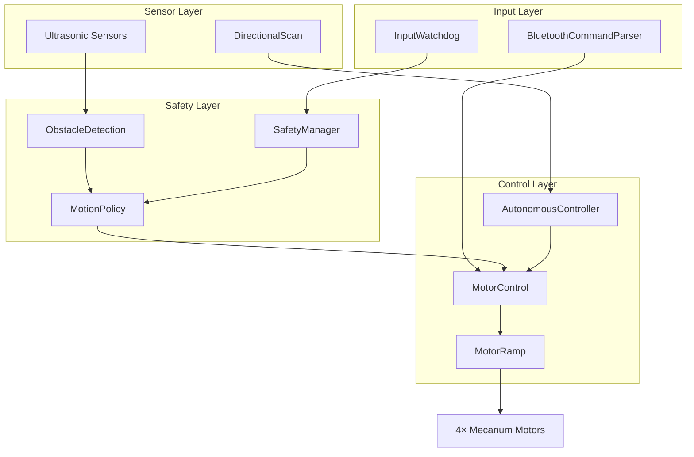

# Project MecanumCar

*This project was developed with AI-assisted code generation and human oversight.*

Bluetooth-controlled Mecanum wheel robot with autonomous obstacle avoidance. Arduino Uno + Motor Shield V2, modular C++ firmware on the Arduino Framework, dual HC-SR04 ultrasonic sensors with servo turret, real-time safety subsystem. Manual driving via Bluetooth app or autonomous mode with pathfinding. Complete rewrite of a commercial kit.

## Hardware

- **MCU**: Arduino Uno R3 (ATmega328P) or Uno R4 (Minima/WiFi)
- **Motor Driver**: Adafruit Motor Shield V2 (TB6612FNG + PCA9685, 12-bit PWM)
- **Wheels**: 4× mecanum (45° rubber rollers)
- **Sensors**: HC-SR04 front (servo-mounted, 5-position sweep) + HC-SR04 rear (static)
- **Servo**: Micro servo (SG90 or compatible) for turret scanning
- **Bluetooth**: HC-05 or HC-06 (9600 baud)
- **Power**: 2× 18650 lithium cells in series
- **Chassis**: Clear acrylic frame

### Bluetooth Module Support

This project supports both HC-05 and HC-06 Bluetooth modules.

| Module | STATE Pin | Connection Detection |
|--------|-----------|----------------------|
| HC-05  | ✅ Yes (D2) | Detects bluetooth disconnection (disabled by default) |
| HC-06  | ❌ No     | Relies on watchdog timeout only |

**HC-05 users:** Connect STATE pin to D2. Set `ENABLE_HC05_STATE_PIN = 1` in `HardwareConfig.h`.

**HC-06 users:** Leave `ENABLE_HC05_STATE_PIN = 0` in `HardwareConfig.h` (default).

### Pin Configuration

| Component | Pins |
|-----------|------|
| Front Ultrasonic TRIG/ECHO | D11 / D12 |
| Rear Ultrasonic TRIG/ECHO | D8 / D9 |
| Servo | D10 |
| Bluetooth RX/TX | D0 / D1 (Hardware Serial) |
| Bluetooth STATE (HC-05 only) | D2 (disabled by default — enable in HardwareConfig.h for HC-05) |
| Battery Monitor (Rev 2) | A0 |
| Encoders (Rev 3) | D3, D4, D5, D6 |

**Note:** On R3, disconnect Bluetooth when uploading (pins shared with USB). On R4, upload with Bluetooth connected (Serial1 is independent).

### Motor Mapping (AFMS V2)

| Wheel | Motor Port |
|-------|------------|
| Front Left | M1 |
| Front Right | M4 |
| Rear Left | M2 |
| Rear Right | M3 |

## About This Project

This is a **complete rewrite** of the ZYC0044 Mini Mecanum Wheel Car kit firmware.

The original kit came with basic Arduino code — functional but limited. This version rebuilds everything from the ground up with proper software architecture, real-time safety systems, autonomous navigation, and support for both Arduino Uno R3 and R4 Series boards.

**Key improvements:**
- Modular C++ architecture instead of a single `.ino` file
- Non-blocking timing (no `delay()`)
- Real-time safety (watchdog, input loss detection, emergency stop)
- Autonomous state machine with pathfinding
- Dual ultrasonic sensors with EMA filtering
- Motor ramping for smooth acceleration
- Hardware UART for Bluetooth (no software serial conflicts)
- HC-05 STATE pin support for connection status
- Full configuration via `Config.h`

**Why this matters:** The same hardware, now capable of much more. Autonomous driving, obstacle avoidance, and safe operation — all in a clean, maintainable codebase.

## Quick Start

### 1. Flash

```bash
# Arduino Uno R3
pio run -e uno -t upload

# Arduino Uno R4 Minima/WiFi
pio run -e uno_r4_minima -t upload

# Monitor (both boards)
pio device monitor -b 9600
```

### 2. Wiring

**Bluetooth:** Connect to pins D0 (RX) and D1 (TX).
- **HC-05:** Connect STATE pin to D2 (optional, enables connection loss detection)
- **HC-06:** No STATE pin, watchdog only

**Note:** On Arduino Uno R3, disconnect Bluetooth when uploading (pins shared with USB). On R4, upload with Bluetooth connected.

### 3. Pair Bluetooth

- Phone Bluetooth settings → HC-05 or HC-06 (PIN usually 1234 or 0000 for HC-06; 1234 for HC-05)
- Android: Install [Bluetooth Electronics](https://www.keuwl.com/apps/bluetoothelectronics/)
- Load custom panel from `archive/Bluetooth Electronics Panels/`

### 4. Drive

- **Manual Mode (0)**: Use d-pad to move, speed slider to control
- **Autonomous Mode (1)**: Robot navigates obstacles automatically

## Configuration

**All settings are split across three config files in `include/config/`:**
- `DebugConfig.h` – Debug output toggles
- `HardwareConfig.h` – Physical hardware presence (pins, sensors installed)
- `Config.h` – Software behavior (thresholds, timing, speed, features)

### Hardware Configuration (HardwareConfig.h)
- **Servo angles** — `SERVO_LEFT`, ...
- **Physical presence flags** — `ENABLE_ULTRASONIC_FRONT`, `ENABLE_SERVO`, `ENABLE_BATTERY_MONITOR`, etc.

### Software Configuration (Config.h)
- **Feature flags** — `ENABLE_INPUT_WATCHDOG`, `ENABLE_OBSTACLE_AVOIDANCE`, `ENABLE_AUTONOMOUS_MODE`, etc.
- **Ultrasonic thresholds** — `FRONT_SLOW_ENTER_CM`, ...

### Features

**Input** (Config.h)
- `ENABLE_INPUT_WATCHDOG` — Bluetooth keepalive (150ms timeout, default: **ON**)
- `ENABLE_INPUT_BUTTONS` — WASD/QE/ZC/JL button commands (default: **ON**)
- `ENABLE_INPUT_JOYSTICK` — Joystick protocol support (default: **OFF** — future feature)
- `ENABLE_INPUT_SPEED_AUTHORITY` — Speed slider (%+, %-, %R/%N/%F) (default: **ON**)

**Navigation & Autonomy** (Config.h)
- `ENABLE_DIRECTIONAL_SCAN` — Servo sweep for obstacle detection (default: **ON**)
- `ENABLE_OBSTACLE_AVOIDANCE` — Front/rear veto logic with hysteresis (default: **ON**)
- `ENABLE_AUTONOMOUS_MODE` — State machine with pathfinding (default: **OFF** — requires OBSTACLE_AVOIDANCE + DIRECTIONAL_SCAN)

**Hardware Presence** (HardwareConfig.h)
- `ENABLE_HC05_STATE_PIN` — HC-05 STATE pin connection detection (default: **OFF** — enable for HC-05)
- `ENABLE_ULTRASONIC_FRONT` — Front HC-SR04 installed (default: **ON**)
- `ENABLE_ULTRASONIC_REAR` — Rear HC-SR04 installed (default: **ON**)
- `ENABLE_SERVO` — Servo for directional scan installed (default: **ON**)
- `ENABLE_BATTERY_MONITOR` — 0-25V voltage sensor (default: **ON**)
- `ENABLE_ENCODERS` — H206 optical encoders (default: **OFF** — future Rev 3 feature)

### Drive Behavior
- **Speed** — `SPEED_USER_MIN` (200 per-mille), `SPEED_USER_MAX` (1000), `SPEED_USER_DEFAULT` (1000)
- **Speed steps** — `SPEED_STEP_ROUGH` (10%), `SPEED_STEP_NORMAL` (5%), `SPEED_STEP_FINE` (1%)
- **Motor ramp** — `RAMP_UP_TIME_MS` (400ms), `RAMP_DOWN_TIME_MS` (200ms)
- **Autonomous speed** — `AUTO_SPEED` (600 per-mille, capped during scanning)
- **Turn ratio** — `TURN_RATIO_NUM` / `TURN_RATIO_DEN` (1/2 default)

### Obstacle Avoidance
- **Slow zone** — 40–50cm → 0.5× speed
- **Stop zone** — 15–25cm → block forward or force backoff
- **Hold time** — `OA_CLEAR_HOLD_MS` (200ms hysteresis)
- **Backoff speed** — `OA_BACKOFF_SPEED` (0.25f per-unit)

### Autonomous Mode
- **Retry wait** — `AUTO_RETRY_WAIT_MS` (2000ms when cornered)
- **Spin time** — `AUTO_SPIN_DIAGONAL_MS` (500ms 45°), `AUTO_SPIN_SIDE_MS` (1000ms 90°)
- **Servo settle** — `SCAN_SERVO_SETTLE_MS` (500ms per position)

## Controls

### Movement (Manual)
- `W/S` — Forward / Backward
- `A/D` — Strafe left / right
- `Q/E/Z/C` — Diagonals (FL, FR, BL, BR)
- `J/L` — Rotate CCW / CW
- `X` — Stop / Heartbeat

### Speed
- `%+` / `%-` — Increase / Decrease (step mode)
- `%R` — Rough (10% steps)
- `%N` — Normal (5% steps)
- `%F` — Fine (1% steps)

### Joystick Input (optional)
- `@1X<val>Y<val>;` — Joystick 1 (strafe + forward/backward)
- `@2X<val>Y<val>;` — Joystick 2 (rotation)

### System
- `!` — Emergency stop (latches)
- `?` — Reset / clear E-stop
- `0` — Manual mode
- `1` — Autonomous mode

See `docs/Control_Protocol.md` for full protocol details and `docs/Code_Layout_Standard.md` for architecture standards.

## Safety Features

- **Watchdog**: 150ms Bluetooth timeout, motion‑aware (active only when moving)
- **Obstacle Detection**: Front/rear independent
  - Clear (>50cm): Full speed
  - Slow (40–50cm): 0.5× speed with hysteresis
  - Stop (<25cm): Block or backoff
- **Sensor Dropout**: `dist==0` treated as clear (sensor glitch absorption)
- **Independent Vetoes**: Front blocked ≠ rear blocked (can reverse when front is blocked)

## Autonomous Mode

1. Drives forward at `AUTO_SPEED` (600 per-mille = 60%)
2. On obstacle: stops, servo sweeps 5 positions (left, FL, center, FR, right)
3. Picks clearest path, rotates toward it
4. Resumes driving
5. If cornered: waits `AUTO_RETRY_WAIT_MS` (2 seconds), retries

**Note:** Autonomous mode is **disabled by default** (`ENABLE_AUTONOMOUS_MODE = 0` in Config.h). Enable it manually if desired. Obstacle avoidance itself is enabled by default.

## Architecture & Code

**Modules** (`src/`, namespaced C++):
- `comms/` — Bluetooth parser, serial output multiplexing
- `control/` — Motor control, ramping (400ms accel/200ms decel), autonomous state machine
- `input/` — Bluetooth watchdog, button/joystick parsing, speed authority
- `safety/` — Obstacle detection with EMA filtering, motion policy
- `sensors/` — HC-SR04 wrapper (`Ultrasonic`), servo sweep (`DirectionalScan`), battery voltage monitor (`BatteryVoltage`)



**Code Layout**: Enforced via `docs/Code_Layout_Standard.md`
- `.h` files: public API only, no implementation
- `.cpp` files: internal state, callbacks, logic, public API
- One module per file, namespaces always
- Hardware ownership rule: one module owns each resource

**Design Patterns**:
- Non-blocking architecture (no `delay()`)
- Threshold tuning over math compensation
- Emergent watchdog (idle `X` resets timeout)
- EMA filtering for sensor noise suppression

## Troubleshooting

**Robot won't move**
- Check E-stop: send `?` to reset
- Verify Bluetooth connected (check serial output)
- Check battery voltage (should be >6V for two 18650s)
- Test individual motors manually
- Check SafetyManager state: `SAFETY_INPUT_LOSS`, `SAFETY_CONNECTION_LOSS`, or `SAFETY_EMERGENCY_STOP` will block motion

**Bluetooth keeps disconnecting**
- Move closer to phone (HC-06 range ~10m)
- Reduce electromagnetic interference
- Try re-pairing
- HC-05 users: ensure `ENABLE_HC05_STATE_PIN` is set correctly in `HardwareConfig.h`
- HC-06 users: disable `ENABLE_HC05_STATE_PIN` in `HardwareConfig.h` (set to 0)

**Obstacle avoidance not working**
- Check sensor wires (HC-SR04 needs GND, 5V, TRIG, ECHO)
- Watch serial output: `[SENS] Front: XX cm`
- Adjust thresholds in `Config.h` if using different sensors
- Enable `DEBUG_OA_REASON` in `DebugConfig.h` to debug veto logic
- Obstacle avoidance is **enabled by default** (`ENABLE_OBSTACLE_AVOIDANCE = 1`)

**Servo doesn't scan**
- Check D10 connection to servo control line
- Verify servo power (should be ~6V, not from Arduino 5V pin)
- Adjust `SERVO_LEFT`, `SERVO_CENTER`, `SERVO_RIGHT` angles

**Robot stops and shows CONNECTION_LOSS**
- HC-05 only: STATE pin detected disconnection
- Only appears when `ENABLE_HC05_STATE_PIN` is enabled
- Re-pair Bluetooth or restart the app
- HC-06 users: disable `ENABLE_HC05_STATE_PIN` in `Config.h`

## Debug Flags

Enable in `DebugConfig.h`:

```cpp
#define DEBUG_ENABLED  1   // Master toggle

#if DEBUG_ENABLED   // EDIT BELOW
    #define COMMS_DEBUG_MIRROR  1   // Echo commands to debug serial
    #define DEBUG_COMMS         0   // Log Bluetooth communication
    #define DEBUG_MOTOR_RAMP    0   // Print ramp calculations
    #define DEBUG_OA_REASON     1   // Print veto reasons
    #define DEBUG_OA_SCALE      1   // Print speed scaling
    #define DEBUG_SENSORS       1   // Print sensor readings
    #define DEBUG_WATCHDOG      1   // Print watchdog resets
#else   // DO NOT EDIT BELOW
    #define COMMS_DEBUG_MIRROR  0
    #define DEBUG_COMMS         0
    #define DEBUG_WATCHDOG      0
    #define DEBUG_SENSORS       0
    #define DEBUG_MOTOR_RAMP    0
    #define DEBUG_OA_REASON     0
    #define DEBUG_OA_SCALE      0
#endif
```

Then `pio device monitor -b 9600` to see output.

## Performance

- Command latency: <10ms
- Motor response: <50ms
- Ultrasonic sampling: ~50ms per sensor
- Servo sweep: ~2.5 seconds (5 positions × 500ms settle)
- Speed ramp: 400ms accel, 200ms decel
- Watchdog timeout: 150ms
- Max speed: ~1.5 m/s (depends on gearing)

## Documentation

- `docs/Control_Protocol.md` — ASCII command protocol reference
- `docs/Code_Layout_Standard.md` — Module organization, file structure standards
- `ARCHITECTURE.md` — Full system design (modules, state machine, safety subsystem)

## For Developers

This project enforces a strict code layout standard documented in [`docs/Code_Layout_Standard.md`](docs/Code_Layout_Standard.md). Key rules:

- One logical module per file
- Headers declare public API only — no implementation
- Source files contain all implementation and internal state
- Comment hierarchy: T1 (file header) → T7 (inline notes)

When contributing, follow the visual hierarchy scale defined in the standard document.

## License

MIT